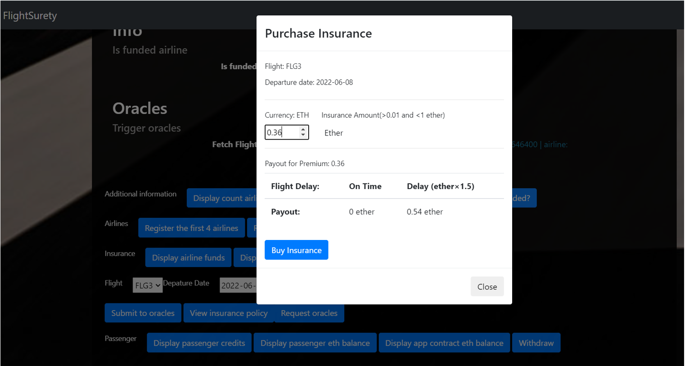
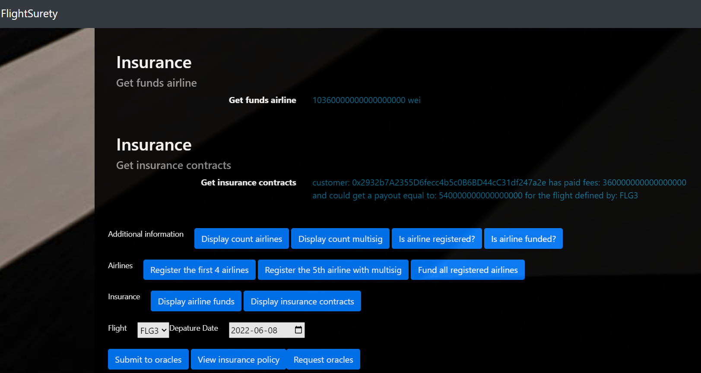
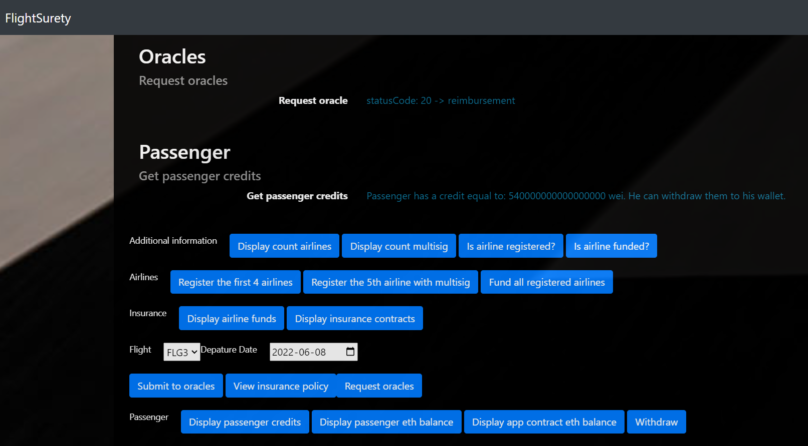
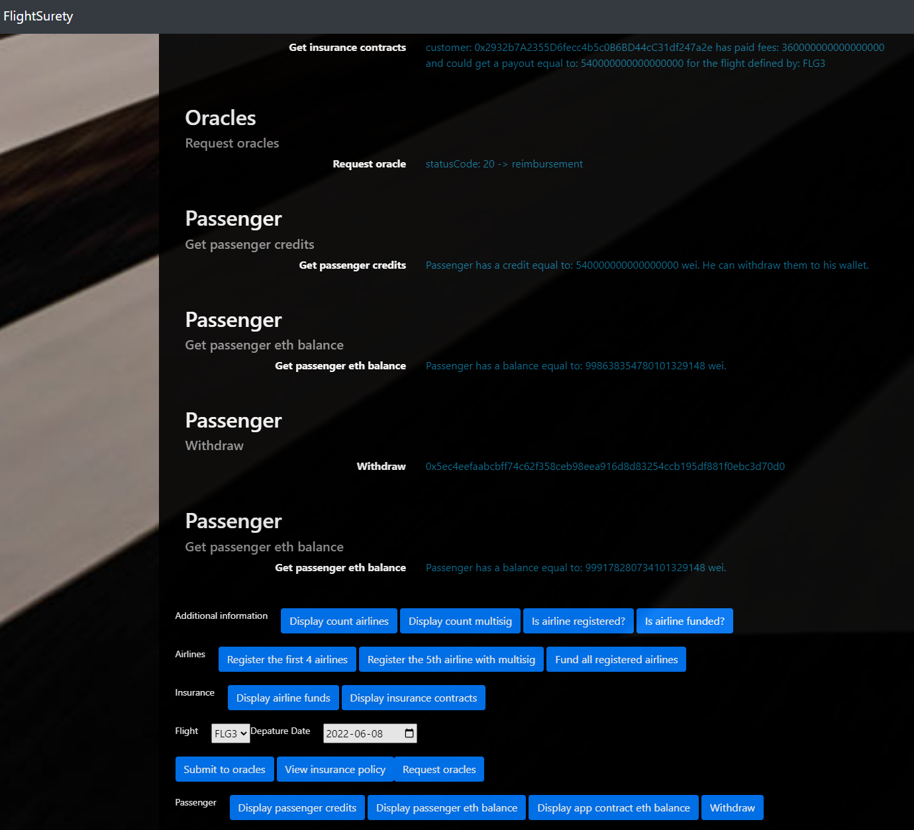

# FlightSurety

FlightSurety is an application project for Udacity's Blockchain nandegree program.

FlightSurety is flight delay insurance for passengers:

- managed as collaboration between multiple airlines
- passengers purchase insurance prior to flight
- if flight is delayed due to airline fault, passengers are paid 1.5X the amount they paid for insurance
- oracles provide flight status information

## Introduction / Features

#### Separation of Concerns, Operational Control and “Fail Fast”

- Separation of concerns:

  - FlightSuretyData contract: data persistence
  - FlightSuretyApp: app logic and oracle code
  - Dapp client: to trigger contract calls available at http://localhost:8000

  ```bash
  npm run dapp
  ```

  - Oracle server application:

  ```bash
  npm run server
  ```

- Operational status control:

  - The operation status control is a boolean variable that can be used to enable or disable the contract. It is used in a modifier.

- "Fail fast":
  - Contract functions “fail fast” by having a majority of “require()” calls at the beginning of function body

#### Airlines

- 1st airline is registered when contract is deployed
- only existing airlines can register a new airline until there are at least 4 airlines registered
  - tested in :
  ```bash
  '(airline) cannot register an Airline using registerAirline() if it is not registered'
  '(airline) can register an Airline using registerAirline() if it is registered but not funded'
  '(airline) can register an Airline using registerAirline() if it is registered and funded'
  ```
- registration of 5th and subsequent airlines requires multi-party consensus of 50% of registered airlines
  - tested in :
  ```bash
  '(airline) can register an Airline using registerAirline() if it is registered and funded using multisig once there are more than 4 airlines'
  ```
- airline can be registered but does not participate in contract until it submits funding of 10 ether
  - tested in :
  ```bash
  '(airline) can fund an Airline using fund() so that it can participate in the contract'
  ```
- accounts 0 to 4 are airlines

- You need to "Fund all registered airlines" before being able to buy insurance

#### Passengers

- may pay up to 1 ether for purchasing flight insurance
- flight numbers and timestamp are simulated: they are fixed for the purpose of the project and can be defined in the Dapp client
- if the flight is delayed due to airline fault, passengers receives credit of 1.5X the amount they paid
- funds are transferred from contract to the passenger wallet only when they initiate withdraw (should implement the "debit before credit" pattern for security reasons)
- accounts 5 to 10 are passengers

#### Oracles

- implemented as a nodejs server app in src/server/server.js
- upon startup, 20+ oracles are registered and their assigned indexes persisted in memory in initOracles()
- for the purpose of the project, the notification that a flight has landed is triggered by clicking on a button on the dapp; it then notifies the contract which is going to call the oracles: btn "request-oracle" in src.dapp.index.html
- workflow:

  1. click on btn "submit-oracle"

  - the user select a flight and a departure time then click on btn "submit-oracle". This will call the function "fetchFlightStatus" from the smart contract that will create a random index associated to the flight and call for oracle requests.
  - the oracle requests will be transmitted to server.js via events.
  - upon reception of the oracle request, the server will store the eventIndex associated to the flight.

  2. after the oracle is submitted, the user can "View the insurance policy" and buy an insurance up to 1 ether.

  3. click on btn "request-oracle"

  - the click call the function "triggerOracleEvent" from the smart contract.
  - the function emit an event "SubmitOracleResponse".
  - upon reception of the event, the "server.js" calls the function "submitOracleResponse" from the smart contract that will update the status in the dedicated storage, emit an event "OracleReport" and if 3 oracles agree, emit an event "FlightStatusInfo" and process the status info

  - the flight status requests with btn "request-oracle" from client Dapp result in OracleReport event emitted by Smart Contract that is captured by server (displayed on console and handled in code)

- accounts 11 to 35 are oracles

#### Contracts

- should be pauseable
- functions must fail fast (use require() at the start of the functions to avoid wasting gas)

#### Features screenshot

- Passengers can buy an insurance up to 1 ether:


- The passenger has bought the insurance (cf log "Get insurance contracts"):


- The flight is late (cf log "Request oracle") so the passenger gets his account credited (cf log "Get passenger credits"):


- The passenger can withdraw the payout he is entitled to. His balance is then credited by the expected amount (cf log "Get passenger eth balance"):


## Install

```bash
node -v: v10.24.0
solidity: 0.4.24
web3: 1.0.0-beta.37
ganache v7.0.2 (@ganache/cli: 0.1.3, @ganache/core: 0.1.3)
```

This repository contains Smart Contract code in Solidity (using Truffle), tests (also using Truffle), dApp scaffolding (using HTML, CSS and JS) and server app scaffolding.

To install, download or clone the repo, then:

`npm install`

`ganache-cli -m "candy maple cake sugar pudding cream honey rich smooth crumble sweet treat" -a 35`
`truffle console --network ganache_cli`
`compile`
`migrate`
`npm run server`
`npm run dapp`

## Clean

`npm install --save-dev prettier prettier-plugin-solidity`
`npx prettier --write 'contracts/**/*.sol'`

## Ganache-cli Client

To start Ganache with N accounts

`ganache-cli -m "candy maple cake sugar pudding cream honey rich smooth crumble sweet treat" -a 35`

To run truffle tests:

`truffle console --network ganache_cli`
`test`

To use the oracles server and the dapp:

`truffle console --network ganache_cli`
`compile`
`migrate`
`npm run server`
`npm run dapp`

To view dapp:

`http://localhost:8000`

## Oracles Server

`npm run server`
`truffle test ./test/oracles.js`

## Deploy

To build dapp for prod:
`npm run dapp:prod`

Deploy the contents of the ./dapp folder

## Troubleshootings

If you have issue with webpack:

```bash
Line 84:
require('webpack-cli/bin/config-yargs')(yargs);
To:
require('webpack-cli/bin/config/config-yargs')(yargs);

Line 92:
const config = require('webpack-cli/bin/convert-argv')(yargs, argv, {
To:
const config = require('webpack-cli/bin/utils/convert-argv')(yargs, argv, {
```

## Resources

- [How does Ethereum work anyway?](https://medium.com/@preethikasireddy/how-does-ethereum-work-anyway-22d1df506369)
- [BIP39 Mnemonic Generator](https://iancoleman.io/bip39/)
- [Truffle Framework](http://truffleframework.com/)
- [Ganache Local Blockchain](http://truffleframework.com/ganache/)
- [Remix Solidity IDE](https://remix.ethereum.org/)
- [Solidity Language Reference](http://solidity.readthedocs.io/en/v0.4.24/)
- [Ethereum Blockchain Explorer](https://etherscan.io/)
- [Web3Js Reference](https://github.com/ethereum/wiki/wiki/JavaScript-API)
